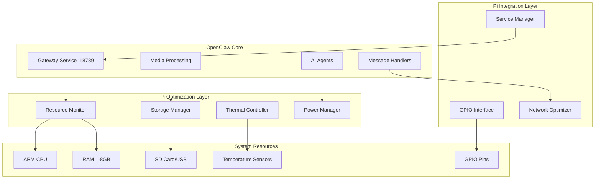

# Design Document: Raspberry Pi Port

## Overview

This design outlines the architecture and implementation strategy for porting OpenClaw to Raspberry Pi OS. The port maintains full functionality while implementing ARM-specific optimizations, resource management, and embedded system features. The design leverages Node.js 22+ native ARM support, implements intelligent resource monitoring, and adds Raspberry Pi-specific capabilities like GPIO integration and thermal management.

## Architecture

### System Architecture



### Component Interaction Flow

The optimization layer sits between OpenClaw core services and system resources, providing:
- Real-time resource monitoring and adaptive scaling
- Thermal-aware performance management
- Storage optimization with wear leveling
- Power-efficient operation modes
- GPIO integration for hardware control

## Components and Interfaces

### Resource Monitor

**Purpose**: Continuously monitor system resources and trigger adaptive responses

**Key Methods**:
- `getSystemMetrics()`: Returns current CPU, memory, disk, and network usage
- `setThresholds(limits)`: Configure resource usage limits per Pi model
- `enableAdaptiveScaling()`: Automatically adjust services based on resource availability
- `getPerformanceProfile()`: Return current performance configuration

**Configuration**:
- Memory limits: 512MB (1GB Pi), 1GB (2GB Pi), 2GB (4GB+ Pi)
- CPU monitoring interval: 1 second
- Disk I/O monitoring with wear leveling awareness
- Network bandwidth optimization based on connection type

### Thermal Controller

**Purpose**: Prevent overheating through proactive thermal management

**Key Methods**:
- `getCurrentTemperature()`: Read CPU temperature from `/sys/class/thermal/`
- `setThermalPolicy(policy)`: Configure throttling thresholds and responses
- `enableFanControl()`: Control GPIO-connected cooling fans
- `getThermalHistory()`: Return temperature trends for analysis

**Thermal Thresholds**:
- 70°C: Reduce CPU-intensive operations by 25%
- 75°C: Reduce CPU-intensive operations by 50%
- 80°C: Pause non-essential services until temperature drops below 75°C

### Storage Manager

**Purpose**: Optimize SD card usage and minimize wear

**Key Methods**:
- `setupTmpfs()`: Configure RAM-based temporary storage
- `rotateLogFiles()`: Implement log rotation with size limits
- `optimizeWrites()`: Batch and distribute writes across storage
- `cleanupCache()`: Remove old cache files when storage is low

**Storage Strategy**:
- Logs: Maximum 100MB total with automatic rotation
- Cache: RAM-first with SD card fallback
- Temporary files: tmpfs mounted directories
- Media processing: External USB storage when available

### GPIO Interface

**Purpose**: Provide secure access to Raspberry Pi hardware capabilities

**Key Methods**:
- `initializeGPIO()`: Set up GPIO access with proper permissions
- `configurePin(pin, mode)`: Configure individual pins for input/output
- `enableProtocol(protocol)`: Enable I2C, SPI, or UART communication
- `readSensor(pin)`: Read data from connected sensors
- `controlDevice(pin, value)`: Control connected devices safely

**Supported Protocols**:
- GPIO: Digital input/output with interrupt support
- I2C: Sensor communication and device control
- SPI: High-speed data transfer
- UART: Serial communication
- PWM: Analog output simulation

### Service Manager

**Purpose**: Integrate OpenClaw with systemd for proper service lifecycle management

**Key Methods**:
- `generateServiceFiles()`: Create systemd service definitions
- `configureAutoStart()`: Set up automatic startup with dependency ordering
- `implementHealthChecks()`: Monitor service health and restart failed services
- `gracefulShutdown()`: Ensure clean service termination

**Service Configuration**:
- Dependency ordering: Network → Storage → Core Services → Extensions
- Restart policy: Exponential backoff with maximum 5 retries
- Health checks: HTTP endpoints and process monitoring
- Shutdown timeout: 30 seconds maximum

### Network Optimizer

**Purpose**: Optimize network performance for typical home network conditions

**Key Methods**:
- `optimizeConnections()`: Implement connection pooling and keep-alive
- `enableCompression()`: Compress data streams to reduce bandwidth usage
- `configureQoS()`: Prioritize critical traffic (Gateway WebSocket)
- `handleFailover()`: Switch between WiFi and Ethernet automatically

**Optimization Features**:
- WebSocket connection pooling for Gateway service
- Data compression for bandwidth-limited connections
- Quality-of-service prioritization for real-time messaging
- Automatic failover between network interfaces

## Data Models

### SystemMetrics

```typescript
interface SystemMetrics {
  timestamp: Date;
  cpu: {
    usage: number;        // Percentage 0-100
    temperature: number;  // Celsius
    frequency: number;    // MHz
    throttled: boolean;
  };
  memory: {
    total: number;        // Bytes
    used: number;         // Bytes
    available: number;    // Bytes
    swapUsed: number;     // Bytes
  };
  storage: {
    total: number;        // Bytes
    used: number;         // Bytes
    available: number;    // Bytes
    writeCount: number;   // For wear leveling
  };
  network: {
    interface: string;    // 'wifi' | 'ethernet'
    bandwidth: number;    // Mbps
    latency: number;      // ms
    packetsLost: number;
  };
}
```

### PiConfiguration

```typescript
interface PiConfiguration {
  model: string;           // 'Pi 4B', 'Pi 5', etc.
  architecture: string;   // 'arm64', 'armv7l'
  memory: {
    total: number;         // Total RAM in MB
    limit: number;         // OpenClaw memory limit in MB
  };
  thermal: {
    thresholds: number[];  // Temperature thresholds in Celsius
    fanPin?: number;       // GPIO pin for fan control
  };
  storage: {
    type: string;          // 'sd', 'usb', 'ssd'
    wearLeveling: boolean;
  };
  gpio: {
    available: number[];   // Available GPIO pins
    reserved: number[];    // Pins reserved for system use
  };
}
```

### ThermalPolicy

```typescript
interface ThermalPolicy {
  monitoring: {
    interval: number;      // Monitoring interval in seconds
    source: string;        // Temperature source path
  };
  thresholds: {
    temperature: number;   // Threshold temperature in Celsius
    action: 'reduce_25' | 'reduce_50' | 'pause_services';
    recovery: number;      // Recovery temperature in Celsius
  }[];
  fanControl?: {
    pin: number;           // GPIO pin for fan
    pwmFrequency: number;  // PWM frequency for variable speed
  };
}
```

### GPIOConfiguration

```typescript
interface GPIOConfiguration {
  pins: {
    [pin: number]: {
      mode: 'input' | 'output' | 'pwm' | 'i2c' | 'spi' | 'uart';
      pullup?: boolean;
      interrupt?: 'rising' | 'falling' | 'both';
      description?: string;
    };
  };
  protocols: {
    i2c?: {
      enabled: boolean;
      frequency: number;    // Hz
    };
    spi?: {
      enabled: boolean;
      speed: number;        // Hz
    };
    uart?: {
      enabled: boolean;
      baudRate: number;
    };
  };
}
```

## Correctness Properties

*A property is a characteristic or behavior that should hold true across all valid executions of a system—essentially, a formal statement about what the system should do. Properties serve as the bridge between human-readable specifications and machine-verifiable correctness guarantees.*

### Property 1: Native ARM Execution
*For any* ARM architecture (ARM64 or ARMv7), when OpenClaw is installed, all Node.js components should execute natively without emulation, achieving performance within 10% of native benchmarks.
**Validates: Requirements 1.1, 1.2**

### Property 2: Dependency Resolution Fallback
*For any* missing native ARM binary dependency, the Package_Manager should successfully resolve the dependency through source compilation or compatible alternatives, resulting in a functional installation.
**Validates: Requirements 1.3**

### Property 3: Architecture-Specific Optimization
*For any* available ARM-specific optimization, the Pi_System should detect and utilize the optimization, resulting in measurable performance improvements over generic implementations.
**Validates: Requirements 1.5**

### Property 4: Hardware-Adaptive Memory Limits
*For any* Raspberry Pi model, the Pi_System should detect the total RAM and enforce appropriate memory limits (512MB for 1GB models, 1GB for 2GB models, 2GB for 4GB+ models), never exceeding the configured limit.
**Validates: Requirements 2.1, 2.2, 2.3**

### Property 5: Memory Pressure Response
*For any* memory usage pattern, when memory usage exceeds 80% of the allocated limit, the Resource_Monitor should trigger garbage collection and gracefully reduce non-essential services, maintaining system stability.
**Validates: Requirements 2.4, 2.5**

### Property 6: Memory-Mapped File Handling
*For any* large media file (>50MB), the Pi_System should use memory-mapped file handling instead of loading the entire file into memory, reducing memory pressure.
**Validates: Requirements 2.6**

### Property 7: Log Rotation Management
*For any* log generation pattern, the Storage_Manager should maintain total log size under 100MB through automatic rotation, preventing unbounded log growth.
**Validates: Requirements 3.1**

### Property 8: Intelligent Caching Strategy
*For any* caching operation, the Storage_Manager should prioritize RAM-based caching and only use SD card storage when RAM cache is full, minimizing SD card writes.
**Validates: Requirements 3.2**

### Property 9: Temporary File Management
*For any* temporary file creation, the Storage_Manager should store files in tmpfs-mounted directories, ensuring they don't contribute to SD card wear.
**Validates: Requirements 3.3**

### Property 10: Storage Wear Leveling
*For any* write operation pattern, the Storage_Manager should distribute writes across available storage locations, preventing concentrated wear on specific sectors.
**Validates: Requirements 3.4**

### Property 11: Automatic Storage Cleanup
*For any* storage usage pattern, when storage usage exceeds 80% capacity, the Storage_Manager should automatically clean old cache and temporary files, maintaining available space.
**Validates: Requirements 3.5**

### Property 12: Thermal Management Response
*For any* CPU temperature reading, the Thermal_Controller should implement appropriate throttling (25% reduction at 70°C, 50% at 75°C, service pause at 80°C) and log all throttling events.
**Validates: Requirements 4.1, 4.2, 4.3, 4.5**

### Property 13: Temperature Monitoring Frequency
*For any* operational period, the Thermal_Controller should monitor CPU temperature at 5-second intervals, ensuring timely thermal response.
**Validates: Requirements 4.4**

### Property 14: Power-Saving Idle Management
*For any* idle period exceeding 5 minutes, the Pi_System should reduce CPU frequency to minimum stable levels and disable unused network interfaces when no messaging sessions are active.
**Validates: Requirements 5.1, 5.2**

### Property 15: Dynamic Service Scaling
*For any* workload variation, the Pi_System should scale services up and down based on current demand, optimizing resource usage and power consumption.
**Validates: Requirements 5.3**

### Property 16: Battery Power Detection
*For any* power source change, when running on battery power, the Pi_System should automatically enable power-saving mode, extending battery life.
**Validates: Requirements 5.4**

### Property 17: GPIO Security and Validation
*For any* GPIO operation request, the GPIO_Interface should validate pin availability and permissions before execution, preventing unauthorized access and hardware conflicts.
**Validates: Requirements 6.1, 6.2**

### Property 18: Real-Time Sensor Integration
*For any* connected hardware sensor, the GPIO_Interface should provide real-time data integration while implementing safety limits to prevent hardware damage.
**Validates: Requirements 6.4, 6.5**

### Property 19: Service Dependency Management
*For any* system boot sequence, the Service_Manager should start OpenClaw services in correct dependency order and implement automatic restart with exponential backoff for failed services.
**Validates: Requirements 7.2, 7.3**

### Property 20: Service Health Monitoring
*For any* running service, the Service_Manager should provide accurate status reporting and health checks, enabling proactive maintenance.
**Validates: Requirements 7.4**

### Property 21: Graceful Shutdown
*For any* system shutdown request, the Service_Manager should stop all services cleanly within 30 seconds, preventing data corruption.
**Validates: Requirements 7.5**

### Property 22: Network Adaptation
*For any* network condition (high latency, limited bandwidth), the Pi_System should implement appropriate optimizations (connection pooling, compression, QoS) to maintain performance.
**Validates: Requirements 8.1, 8.2**

### Property 23: Network Failover
*For any* network interface failure, the Pi_System should automatically switch between WiFi and Ethernet, maintaining connectivity without manual intervention.
**Validates: Requirements 8.3**

### Property 24: Offline Message Handling
*For any* network connectivity loss, the Pi_System should queue messages and retry transmission when connectivity is restored, ensuring no message loss.
**Validates: Requirements 8.4**

### Property 25: WebSocket Efficiency
*For any* WebSocket connection, the Gateway_Service should maintain connections with minimal resource overhead, supporting concurrent connections efficiently.
**Validates: Requirements 8.5**

### Property 26: Comprehensive Resource Monitoring
*For any* system operation, the Resource_Monitor should accurately track CPU usage, memory consumption, disk I/O, and network throughput, providing complete system visibility.
**Validates: Requirements 9.1**

### Property 27: Performance Alert Generation
*For any* performance metric, when values exceed defined thresholds, the Resource_Monitor should generate appropriate alerts and provide automated diagnostic suggestions.
**Validates: Requirements 9.2, 9.5**

### Property 28: Performance Data Logging
*For any* monitoring period, the Resource_Monitor should log performance data for historical analysis and trend identification, enabling proactive optimization.
**Validates: Requirements 9.4**

### Property 29: Hardware Detection and Optimization
*For any* Raspberry Pi model, during installation, the Pi_System should automatically detect the hardware model and optimize configuration accordingly, ensuring optimal performance.
**Validates: Requirements 10.2**

### Property 30: Update Rollback Capability
*For any* update failure, the Pi_System should provide rollback capability, restoring the previous working configuration without data loss.
**Validates: Requirements 10.4**

### Property 31: Automatic Dependency Management
*For any* package installation or update, the Package_Manager should handle dependency management and version compatibility automatically, preventing conflicts.
**Validates: Requirements 10.5**

## Error Handling

### Thermal Emergency Response
- **Critical Temperature (>85°C)**: Immediate system shutdown to prevent hardware damage
- **Sensor Failure**: Fallback to conservative thermal limits and alert generation
- **Fan Control Failure**: Automatic CPU frequency reduction and user notification

### Memory Exhaustion Handling
- **Out of Memory**: Graceful service degradation with priority-based service termination
- **Memory Leak Detection**: Automatic service restart with memory usage monitoring
- **Swap Thrashing**: Immediate swap disable and memory optimization activation

### Storage Failure Management
- **SD Card Corruption**: Automatic fallback to read-only mode with external storage migration
- **Write Failure**: Retry with exponential backoff and alternative storage location
- **Storage Full**: Emergency cleanup with user notification and service prioritization

### Network Failure Recovery
- **Connection Loss**: Message queuing with persistent storage and retry mechanisms
- **Interface Failure**: Automatic failover with connection state preservation
- **DNS Resolution Failure**: Local caching and alternative DNS server fallback

### GPIO Hardware Protection
- **Overcurrent Detection**: Immediate pin shutdown and safety alert
- **Voltage Spike Protection**: Hardware isolation and error logging
- **Pin Conflict Resolution**: Automatic resource arbitration and user notification

### Service Failure Recovery
- **Process Crash**: Automatic restart with crash dump collection
- **Dependency Failure**: Service isolation and alternative pathway activation
- **Resource Exhaustion**: Service throttling and resource reallocation

## Testing Strategy

### Dual Testing Approach

The testing strategy employs both unit testing and property-based testing to ensure comprehensive coverage:

**Unit Tests**: Focus on specific examples, edge cases, and error conditions including:
- Hardware detection accuracy for different Pi models
- Thermal threshold trigger points and recovery behavior
- GPIO pin configuration and safety limit enforcement
- Service startup and shutdown sequences
- Network failover scenarios

**Property-Based Tests**: Verify universal properties across all inputs including:
- Resource management under varying load conditions
- Thermal management across temperature ranges
- Storage optimization across different usage patterns
- Network adaptation across various connection conditions
- Service lifecycle management across different failure scenarios

### Property-Based Testing Configuration

**Testing Framework**: Use `fast-check` for TypeScript/Node.js property-based testing
**Test Configuration**: Minimum 100 iterations per property test to ensure statistical confidence
**Test Tagging**: Each property test tagged with format: **Feature: raspberry-pi-port, Property {number}: {property_text}**

**Example Property Test Structure**:
```typescript
// Feature: raspberry-pi-port, Property 4: Hardware-Adaptive Memory Limits
test('memory limits adapt to hardware', () => {
  fc.assert(fc.property(
    fc.record({
      totalRAM: fc.integer(1024, 8192), // MB
      model: fc.constantFrom('Pi 3B+', 'Pi 4B', 'Pi 5')
    }),
    (hardware) => {
      const config = detectHardwareAndSetLimits(hardware);
      const expectedLimit = calculateExpectedLimit(hardware.totalRAM);
      expect(config.memoryLimit).toBeLessThanOrEqual(expectedLimit);
    }
  ));
});
```

### Integration Testing

**Hardware Simulation**: Mock Raspberry Pi hardware interfaces for consistent testing
**Performance Benchmarking**: Automated performance regression testing across Pi models
**Thermal Simulation**: Controlled temperature testing using thermal simulation tools
**Network Condition Testing**: Simulated network conditions for optimization validation
**Long-Running Stability**: 24-hour continuous operation tests for stability verification

### Test Environment Requirements

**Physical Hardware**: Testing on actual Raspberry Pi 3B+, 4B, and 5 models
**Virtualization**: ARM64 virtual machines for development testing
**CI/CD Integration**: Automated testing pipeline with hardware-in-the-loop testing
**Performance Monitoring**: Continuous performance monitoring during test execution
**Regression Testing**: Automated regression testing for each code change